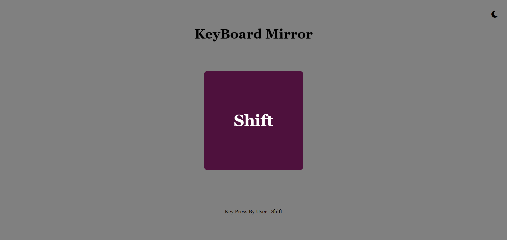
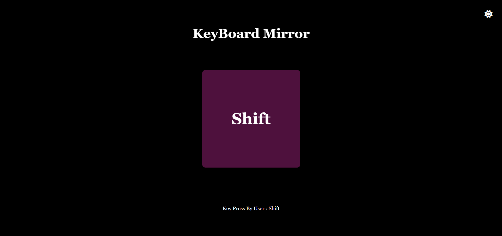
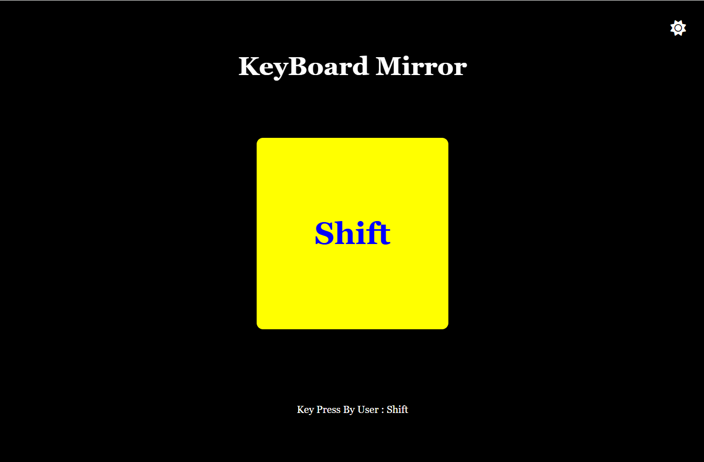

# KeyBoard-Mirror

📖 Detailed Description (for README.md)
**🎹 Keyboard Mirror**

The Keyboard Mirror is a fun and interactive web project built using HTML, CSS, and JavaScript (DOM Manipulation).
It visually mirrors every key you press on your keyboard directly onto the screen in real-time.

**🚀 Features**

**⌨️ Real-time Key Press Detection** – instantly shows the key you press.

**🎨 Dark & Bright Theme Toggle** – switch between light and dark UI for better accessibility.

**🖱️ DOM Manipulation** – built using JavaScript’s DOM methods for dynamic updates.

**💡 Interactive UI** – clean and user-friendly design.
**🖱️ Mouse Hover Effect** – background and text color dynamically change on mouse events.

**⚡ Lightweight & Fast** – no external dependencies, runs directly in the browser.

**🛠️ Tech Stack**

HTML5 – structure

CSS3 – styling and themes

JavaScript (DOM) – logic for key detection, theme toggle, and dynamic rendering

**📷 Demo Screenshot**

  

**on MouseEvent**

**📂 How to Use**

Clone this repository:

git clone https://github.com/Mohammad-Saif72/KeyBoard-Mirror.git

Open index.html in your browser.

Start typing and see your keys mirrored on screen!

**🌟 Learning Highlights**

Practiced JavaScript DOM Manipulation (getElementById, querySelector, addEventListener, style, classList)

Implemented Dark/Light Theme Toggle using DOM methods

Built a responsive UI with simple HTML + CSS + JS

